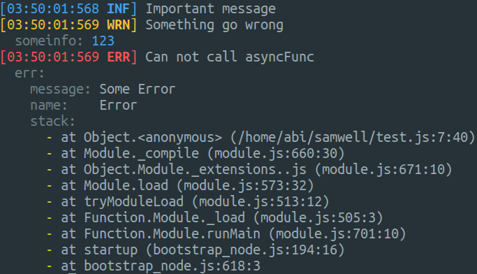

# samwell
[](https://travis-ci.org/abihf/samwell)
[](https://codecov.io/gh/abihf/samwell)

Almost zero config, isomorphic logger for Javascript

## Install
```sh
yarn add samwell
```

## Usage
### Basic
```ts
import * as logger from 'samwell'

logger.info('Important message');
logger.warn('Something go wrong', {someinfo: something});
asyncFunc().catch((e) => logger.error('Can not call asyncFunc', e));
```

### Pretty and json formating
You can add server registration function on your entry point file.
```ts
import * as logger from 'samwell'
import * as samwellRegisterServer from 'samwell/register-server';

// You only need call it once
samwellRegisterServer(logger);
```

**Terminal output**
[](terminal-writer.png)

**JSON Output** (NODE_ENV=production)
```json
{"time":"2017-12-22T20:44:53.712Z","level":"info","msg":"Important message"}
{"time":"2017-12-22T20:44:53.712Z","level":"warn","msg":"Something go wrong","context":{"someinfo":123}}
{"time":"2017-12-22T20:44:53.712Z","level":"error","msg":"Can not call asyncFunc","context":{"err":{"message":"Some Error","name":"Error","stack":["at Object.<anonymous> (/home/abi/samwell/test.js:7:40)","at Module._compile (module.js:660:30)","at Object.Module._extensions..js (module.js:671:10)","at Module.load (module.js:573:32)","at tryModuleLoad (module.js:513:12)","at Function.Module._load (module.js:505:3)","at Function.Module.runMain (module.js:701:10)","at startup (bootstrap_node.js:194:16)","at bootstrap_node.js:618:3"]}}}
```

## License
See the [LICENSE](LICENSE) file for license rights and limitations (MIT).
